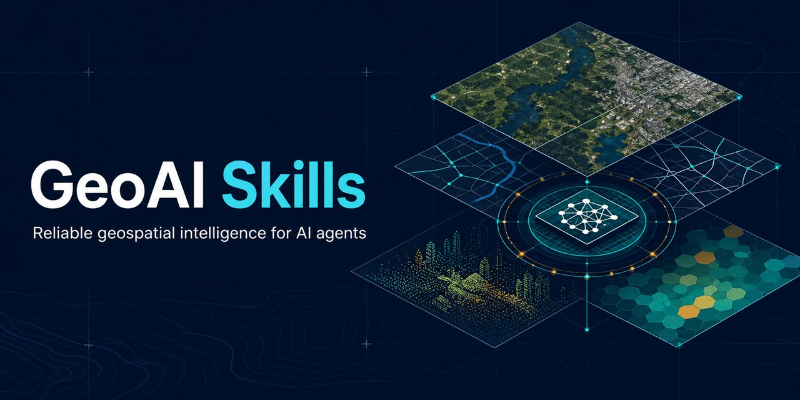

# GeoAI Skills



**Turn your AI agent into a senior geospatial data scientist.**

17 [Agent Skills](https://agentskills.io) covering the full geospatial data science lifecycle — from STAC search and PostGIS to kriging uncertainty and U-Net inference — designed around documented silent failure modes in spatial computing.

[](https://github.com/muend/geoai-skills/actions)
[](LICENSE)
[](#whats-inside)
[](https://agentskills.io)

---

## Why this exists

Spatial bugs are **silent**. A buffer computed in degrees still returns numbers. A random train/test split on spatial data still produces a beautiful learning curve — a fraudulent one. An unprojected choropleth still renders. Web Mercator still shows Greenland bigger than Africa.

General-purpose LLMs know the APIs but routinely commit every one of these errors, because nothing in the output *looks* wrong.

These skills encode the discipline that separates a practitioner from an API caller:

- **CRS is explicit, always** — never compute area/distance in a geographic CRS
- **Spatial leakage is the default enemy** — every ML-adjacent skill enforces spatial blocking
- **Every stage ends with a verification check** — visual + numeric, row-count accounting, error maps
- **Uncertainty is a deliverable** — kriging SD rasters, sensitivity analyses, error-adjusted area estimates with CIs, FDR-corrected cluster maps

## What's inside

```
                       ┌─────────────────────┐
                       │  geoai-orchestrator │  ← entry point, pipeline design,
                       └──────────┬──────────┘    module-wide invariants
        ┌──────────┬─────────────┼─────────────┬───────────────┐
    ACQUIRE      SENSE         MODEL         ANALYZE         DELIVER
        │           │             │             │               │
  geo-data-    remote-       geo-deep-     spatial-        cartography-
  engineering  sensing-      learning      statistics      geoviz
        │      analysis          │             │
  postgis-         │        change-       geostatistics-
  spatial-sql      │        detection     interpolation
        │      google-           │             │
  point-cloud- earth-       terrain-      mcda-suitability-
  lidar        engine       hydrology     analysis
        │                        │             │
        └── movement-trajectory ─┴── network-accessibility-analysis

  cross-cutting: ml-experiment-standards · swe-devops-standards
```

| # | Skill | Covers |
|---|-------|--------|
| 1 | [`geoai-orchestrator`](skills/geoai-orchestrator/SKILL.md) | Routing, pipeline design, 8 module-wide invariants (CRS, validity, leakage, units…) |
| 2 | [`geo-data-engineering`](skills/geo-data-engineering/SKILL.md) | Formats (GeoParquet/COG/Zarr), OSM/Overture/STAC acquisition, CRS engineering, cleaning, scale strategies |
| 3 | [`remote-sensing-analysis`](skills/remote-sensing-analysis/SKILL.md) | STAC search, L1/L2 discipline, cloud masking, spectral indices, classification, SAR |
| 4 | [`google-earth-engine`](skills/google-earth-engine/SKILL.md) | GEE Python API: filtering/compositing at planetary scale, reducers, exports, geemap, quota-aware patterns |
| 5 | [`geo-deep-learning`](skills/geo-deep-learning/SKILL.md) | U-Net/detection on EO imagery, chipping, spatial split policy, imbalanced losses, sliding-window inference |
| 6 | [`spatial-statistics`](skills/spatial-statistics/SKILL.md) | Weights design, Moran/LISA/Gi*, point patterns, SAR/SEM/GWR decision path, MAUP/FDR honesty |
| 7 | [`mcda-suitability-analysis`](skills/mcda-suitability-analysis/SKILL.md) | AHP + consistency ratio, standardization, WLC/OWA, mandatory sensitivity analysis |
| 8 | [`geostatistics-interpolation`](skills/geostatistics-interpolation/SKILL.md) | Variogram modeling, kriging + uncertainty rasters, LOOCV/block CV |
| 9 | [`terrain-hydrology`](skills/terrain-hydrology/SKILL.md) | DEM hygiene, slope/aspect/curvature, hydrological conditioning, watersheds, viewshed |
| 10 | [`point-cloud-lidar`](skills/point-cloud-lidar/SKILL.md) | PDAL pipelines, ground classification, DTM/DSM/CHM generation, forestry & building metrics |
| 11 | [`network-accessibility-analysis`](skills/network-accessibility-analysis/SKILL.md) | OSMnx/r5py routing, isochrones, OD matrices, 2SFCA, location-allocation, GTFS |
| 12 | [`movement-trajectory`](skills/movement-trajectory/SKILL.md) | GPS trajectory cleaning, stop/trip detection, map matching, movement metrics (MovingPandas) |
| 13 | [`change-detection`](skills/change-detection/SKILL.md) | Co-registration, differencing/CVA/PCC, time-series breaks, Olofsson-style area estimation |
| 14 | [`cartography-geoviz`](skills/cartography-geoviz/SKILL.md) | Map type/classification/color selection, projection honesty, static + interactive delivery |
| 15 | [`postgis-spatial-sql`](skills/postgis-spatial-sql/SKILL.md) | Spatial schema/indexing, predicate correctness, performance playbook, DuckDB Spatial |
| 16 | [`ml-experiment-standards`](skills/ml-experiment-standards/SKILL.md) | Leakage audits, metric justification, reproducibility skeleton, canonical [spatial CV protocol](skills/ml-experiment-standards/references/spatial-cv-protocol.md) |
| 17 | [`swe-devops-standards`](skills/swe-devops-standards/SKILL.md) | Production-grade Python defaults, testing, dependency pinning, git/CI practices |

## Installation

**Claude Code / Cowork (as a plugin):**

```
/plugin marketplace add muend/geoai-skills
/plugin install geoai@geoai-skills
```

**Claude.ai / Claude desktop:** upload any skill folder (or zip it as `.skill`) via *Settings → Capabilities → Skills*. Skills install independently — install all 17 for full routing, or cherry-pick.

**Any Agent-Skills-compatible runtime:** copy folders from `skills/` into your agent's skills directory. Each skill is self-contained; cross-references degrade gracefully when a referenced skill is absent.

### Installation profiles and dependencies

- **Full suite (recommended):** install all skills so the orchestrator and
  cross-cutting verification standards are available together.
- **Core profile:** install `geoai-orchestrator`,
  `ml-experiment-standards`, and `swe-devops-standards` alongside any
  specialist skills used in multi-stage work.
- **Cherry-picked skill:** it must remain safe and useful by itself. Sibling
  skill references are advisory; critical safety rules require a local
  fallback. CI will progressively enforce this contract.

The open Agent Skills specification does not currently provide a portable
dependency resolver. Installation documentation must therefore state required
profiles explicitly rather than assuming sibling skills are present.

## Usage

You don't invoke these skills — they trigger on your task. Just ask naturally:

> *"I have parcel shapefiles and Sentinel-2 imagery for a region. Build a land suitability model for solar farms."*

The orchestrator decomposes this into a pipeline (data engineering → remote sensing → terrain → MCDA → cartography), routes each stage to the specialist skill, and enforces the invariants at every step — you'll get CRS reports, row-count accounting, a consistency-checked AHP, a sensitivity analysis, and a colorblind-safe map, without asking for any of them.

Other things that just work:

- *"Detect urban growth between these two years"* → co-registration checks, defensible thresholding, error-adjusted area estimates with confidence intervals
- *"Interpolate these rainfall stations"* → variogram discipline, kriging **with** an uncertainty raster, spatially honest cross-validation
- *"Train a U-Net to extract buildings"* → spatially blocked splits, imbalance-aware losses, georeferencing-preserving inference
- *"Why is this spatial join so slow?"* → EXPLAIN-driven PostGIS playbook, `ST_Subdivide`, index-sargable predicates

## Design principles

1. **Fail-loud spatial computing.** Every skill mandates accounting reports, verification protocols, and visual + numeric double checks.
2. **Methodological honesty.** Permutation inference, FDR correction, sensitivity analysis, uncertainty rasters, and error-adjusted area estimates are deliverables, not extras.
3. **Anti-leakage by default.** Spatial autocorrelation makes random splits fraudulent; one canonical [spatial CV protocol](skills/ml-experiment-standards/references/spatial-cv-protocol.md), referenced everywhere, restated nowhere.
4. **Tool-pragmatic.** Open Python stack first (GeoPandas, rasterio, xarray, PySAL, PDAL, OSMnx, WhiteboxTools), with routes to PostGIS/DuckDB at scale, Earth Engine for planetary archives, and headless arcpy/PyQGIS for proprietary environments.
5. **Progressive disclosure.** Descriptions are tuned for reliable triggering; bodies stay lean; long material lives in `references/` and `scripts/` at zero token cost until needed.
6. **Measured, not assumed.** The suite contains 120 typed behavior scenarios across all 17 skills: 84 positive, 36 negative, 27 ambiguous, 41 collision, and 35 artifact-correctness cases (types may overlap). The [provider-neutral evaluation harness](EVALUATION.md) creates blind requests, caches raw outputs, and emits deterministic machine-readable metrics. Runtime baselines remain tracked in [ROADMAP.md](ROADMAP.md). Illustrative failure modes live in [CASE_STUDIES.md](CASE_STUDIES.md) until reproducible real-world evidence is available.

## Repository structure

```
geoai-skills/
├── skills/<skill-name>/
│   ├── SKILL.md            # the skill (agent-facing)
│   ├── scripts/            # runnable code, loaded on demand
│   ├── references/         # deep material, loaded on demand
│   └── evals/evals.json    # ≥7 typed routing + behavior scenarios
├── tools/validate_skills.py  # spec linter (runs in CI)
├── tools/validate_evals.py   # strict, versioned eval schema validation
├── tools/eval_runner.py      # deterministic prepare → ingest → score harness
├── evals/schema.json         # shared JSON Schema for all skill evals
├── evals/run-schema.json     # manifests, responses, judgments, and results
├── EVALUATION.md             # adapter-neutral benchmark protocol
├── .claude-plugin/           # marketplace + plugin manifests
└── CASE_STUDIES.md           # reproducible or clearly labeled failure cases
```

## Contributing

PRs welcome — see [CONTRIBUTING.md](CONTRIBUTING.md). The bar: passes the linter, ships evals, doesn't duplicate a canonical rule, and ends with a verification protocol. Real-world catches belong in [CASE_STUDIES.md](CASE_STUDIES.md) only with reproducible, privacy-safe evidence.

## Roadmap

3D city models (CityGML/3D Tiles) · geospatial foundation models in production · GeoParquet-native lakehouse patterns · agentic field-data QA (ODK/Kobo).

## License

[MIT](LICENSE) — use it, fork it, ship it. If this repo saved you from a silent spatial bug, a ⭐ helps others find it.
