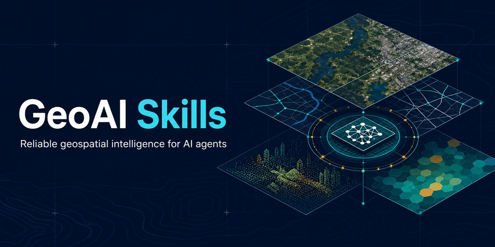
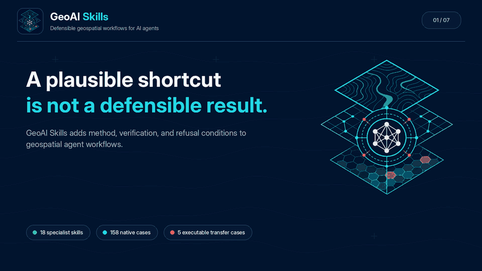

# GeoAI Skills



## The correctness layer for geospatial AI agents

**Stop silent CRS, spatial-leakage, validity, unit, and uncertainty failures before
they ship.**

GeoAI Skills is a vendor-neutral collection of 18
[Agent Skills](https://agentskills.io) that turns a general-purpose AI agent into a
more defensible geospatial collaborator. It covers the full workflow—from STAC
search and PostGIS to spatial statistics, Earth observation, LiDAR, cartography,
and guarded ArcGIS Pro automation—while making verification and limitations part
of the deliverable.

[](https://github.com/muend/geoai-skills/actions)
[](LICENSE)
[](#the-18-skill-stack)
[](#evidence-with-boundaries)
[](https://www.skills.sh/muend/geoai-skills)
[](https://agentskills.io)

<p align="center">
  
</p>

<p align="center">
  <strong>A plausible shortcut is not a defensible result.</strong><br />
  <a href="assets/demo/geoai-guardrail-demo.mp4">Watch the short MP4</a>
  ·
  <a href="assets/demo/geoai-guardrail-demo-poster.png">View the static verdict</a>
  ·
  <a href="#quick-start">Install</a>
  ·
  <a href="#evidence-with-boundaries">Inspect the evidence</a>
</p>

The demo uses a public, synthetic prompt. It shows the intended guardrail behavior,
not a claim that every model or runtime will produce identical wording.

## Quick start

Install the complete suite for Codex:

```bash
npx skills add muend/geoai-skills --skill '*' -a codex
```

Or install one specialist for Claude Code:

```bash
npx skills add muend/geoai-skills \
  --skill remote-sensing-analysis \
  -a claude-code
```

Then ask naturally:

> Can May 2024 and September 2025 Sentinel-2 scenes support a defensible
> changed-hectares claim?

The relevant skills should activate automatically. Instead of blindly subtracting
two rasters, the agent is instructed to test comparability, identify the
phenological mismatch, withhold an unsupported area claim, and specify the evidence
needed to proceed.

## What changes when the skills are present

| A plausible shortcut | GeoAI Skills guardrail |
|---|---|
| Measure area in EPSG:4326 because the operation returns a number. | Select and record an appropriate projected CRS; verify units before reporting area or distance. |
| Randomly split spatial samples and report a high validation score. | Audit spatial and group leakage; use blocked validation and show geographic error structure. |
| Count changed pixels from two convenient dates. | Check season, sensor, processing level, registration, mutual masks, threshold sensitivity, and error-adjusted area uncertainty. |
| Sum overlapping spatial intersections. | Dissolve or deduplicate overlap before measurement and preserve an auditable accounting path. |
| Render a map and assume it communicates honestly. | Check projection, classification, palette accessibility, legend semantics, uncertainty, and export metadata. |
| Run a destructive local GIS mutation immediately. | Inspect first, plan the mutation, require an explicit gate, verify outputs, and retain recovery evidence. |

These skills complement MCP servers, GIS libraries, and hosted tools. They are the
method and verification layer that tells an agent **when not to trust an apparently
successful operation**.

## Why this exists

Spatial bugs are unusually quiet:

- a buffer computed in degrees still returns numbers;
- a random spatial train/test split still produces a beautiful learning curve;
- a misregistered change map still shows crisp-looking boundaries;
- overlapping polygons can silently inflate an area total;
- an attractive choropleth can still encode the wrong class semantics.

General-purpose models often know the APIs. The harder problem is knowing which
preconditions, controls, and refusal conditions make a geospatial claim defensible.
GeoAI Skills encodes that discipline:

- **CRS and units are explicit.**
- **Spatial leakage is treated as a default risk.**
- **Every stage ends with numeric and visual verification.**
- **Uncertainty and sensitivity are outputs, not optional footnotes.**
- **Missing evidence narrows or blocks the claim instead of being guessed.**

## Evidence with boundaries

The current source tree contains two deliberately separate evaluation layers:

| Evidence layer | Current coverage | What it supports |
|---|---:|---|
| Native skill suite | **158 cases** across 18 skills; 96 development and 62 held-out | Routing boundaries, negative activation, collisions, interaction modes, and artifact requirements |
| GeoAnalystBench-derived external subset | **5 executable cases** with deterministic synthetic fixtures and artifact validators | Transfer checks for network analysis, facility coverage, vegetation change, urban heat/kriging, and spatial regression |
| Platform verification | Windows, macOS, and Linux CI; clean installs for Codex, Claude, Skills CLI, and GitHub Copilot | Packaging, portability, runtime-file isolation, and deterministic archives |

The external subset is independently authored and reported separately. It does not
copy upstream datasets, prompts, or reference implementations, and its outcomes must
not be pooled with native routing metrics. Its five-case v1 source population is
frozen under suite hash `c99563100cac…`; a separate v2 contract freeze distinguishes
semantic correctness, evidence sufficiency, and exact representation compliance
without changing those cases. Frozen producer interface v1 preserves the first
shape-only condition; v2 adds answer-safe method, serialization, UTF-8, and
workspace execution guidance after observed cross-runtime ambiguities, without
exposing reference values. The separately frozen v3 condition pairs a semantic
validator with fully disclosed nested output structures, bounded floating-point
tolerance, exact inventory checks, and representation-independent map checks;
historical v1/v2 evidence remains unchanged. Every deterministically rendered
prompt is hashed.
Results follow the
[offline run and result protocol](evals/external/geoanalystbench/README.md#external-run-protocol),
which reports skill activation, runtime completion, artifact-contract compliance,
and overall success as separate measures.

A current 18-skill, 158-case Claude Code run recorded **100% routing precision,
92.37% routing recall, and 93.67% full-route accuracy** on suite
`f03e327a57d2…` under Claude Code `2.1.214` with `claude-sonnet-5` (2026-08-04).
The paired skills-disabled control produced zero activations across all 158
cases. All nine false negatives and all seven `max_turns` execution errors were
inspected; the four enabled errors had already recorded their correct target
activation, so the enabled routing metrics are unaffected. Behavior quality
remains **unclaimed** until independent-family judging and the manual-review
protocol are complete.

Read [BENCHMARK.md](BENCHMARK.md) for the full result card and
[EVALUATION.md](EVALUATION.md) for the provider-neutral protocol, suite hashes,
split rules, judge boundaries, and publication gates.

## The 18-skill stack

| Stage | Skills | What they protect |
|---|---|---|
| Route and acquire | [`geoai-orchestrator`](skills/geoai-orchestrator/SKILL.md), [`geo-data-engineering`](skills/geo-data-engineering/SKILL.md), [`google-earth-engine`](skills/google-earth-engine/SKILL.md) | Problem decomposition, provenance, formats, CRS, scale, and server-side execution |
| Sense and prepare | [`remote-sensing-analysis`](skills/remote-sensing-analysis/SKILL.md), [`point-cloud-lidar`](skills/point-cloud-lidar/SKILL.md), [`terrain-hydrology`](skills/terrain-hydrology/SKILL.md), [`movement-trajectory`](skills/movement-trajectory/SKILL.md) | Sensor/processing-level comparability, masks, elevation surfaces, point-cloud semantics, and trajectory cleaning |
| Model and detect | [`geo-deep-learning`](skills/geo-deep-learning/SKILL.md), [`change-detection`](skills/change-detection/SKILL.md), [`ml-experiment-standards`](skills/ml-experiment-standards/SKILL.md) | Leakage, chipping, imbalance, registration, threshold sensitivity, spatial validation, and reproducibility |
| Analyze and decide | [`spatial-statistics`](skills/spatial-statistics/SKILL.md), [`geostatistics-interpolation`](skills/geostatistics-interpolation/SKILL.md), [`mcda-suitability-analysis`](skills/mcda-suitability-analysis/SKILL.md), [`network-accessibility-analysis`](skills/network-accessibility-analysis/SKILL.md), [`postgis-spatial-sql`](skills/postgis-spatial-sql/SKILL.md) | Weights, inference, multiple testing, kriging uncertainty, AHP consistency, routing barriers, overlap, SQL correctness, and performance |
| Deliver and operate | [`cartography-geoviz`](skills/cartography-geoviz/SKILL.md), [`swe-devops-standards`](skills/swe-devops-standards/SKILL.md), [`arcgis-pro-automation`](skills/arcgis-pro-automation/SKILL.md) | Honest visual encoding, production code, test/transaction discipline, and gated local ArcGIS mutations |

Install the full suite for cross-skill routing, or cherry-pick a specialist. Every
skill must remain safe and useful alone; sibling references are advisory and
critical safeguards have local fallbacks.

## Installation

Choose the surface you already use.

| Surface | Recommended path |
|---|---|
| OpenAI Codex | `npx skills add muend/geoai-skills --skill '*' -a codex` |
| Claude Code | `claude plugin marketplace add muend/geoai-skills` then `claude plugin install geoai@geoai-skills` |
| GitHub Copilot | `gh skill install muend/geoai-skills remote-sensing-analysis` |
| Skills CLI / compatible agents | `npx skills add muend/geoai-skills` |
| ChatGPT | Install **GeoAI Skills** from the OpenAI Plugins Directory |
| Claude.ai / Claude desktop | Upload one or more release ZIP files from the latest GitHub Release |

<details>
<summary><strong>Skills CLI and skills.sh</strong></summary>

Browse the collection on [skills.sh](https://www.skills.sh/muend/geoai-skills)
or inspect it without installing:

```bash
npx skills add muend/geoai-skills --list
```

Install all 18 skills for Claude Code:

```bash
npx skills add muend/geoai-skills --skill '*' -a claude-code
```

Install all 18 skills for Codex:

```bash
npx skills add muend/geoai-skills --skill '*' -a codex
```

Run `npx skills add muend/geoai-skills` without flags for the interactive agent
and skill picker.

</details>

<details>
<summary><strong>OpenAI Codex / ChatGPT plugin</strong></summary>

Version `0.2.0` is published in the OpenAI Plugins Directory as **GeoAI Skills**.
The repository is a skills-only plugin: it adds no hosted service, authentication
flow, or MCP server.

Build the deterministic upload archive:

```bash
python tools/build_openai_plugin_bundle.py
```

The ignored `dist/` output contains only the plugin manifest, public policy pages,
logo, and runtime skill files. Evaluation cases, benchmark traces, repository
automation, and private development material are excluded.

</details>

<details>
<summary><strong>Claude Code and Claude Cowork</strong></summary>

From a terminal:

```bash
claude plugin marketplace add muend/geoai-skills
claude plugin install geoai@geoai-skills
```

From an interactive Claude Code session:

```text
/plugin marketplace add muend/geoai-skills
/plugin install geoai@geoai-skills
```

Installed skills use the stable `geoai` namespace, for example:

```text
/geoai:remote-sensing-analysis
```

</details>

### GitHub Copilot

GitHub Copilot can load project skills from `.github/skills`, `.claude/skills`,
or `.agents/skills`. With GitHub CLI 2.90.0 or later, preview before installing:

```bash
gh skill preview muend/geoai-skills remote-sensing-analysis
gh skill install muend/geoai-skills remote-sensing-analysis
```

The Skills CLI also provides an explicit Copilot target:

```bash
npx skills add muend/geoai-skills \
  --skill remote-sensing-analysis \
  -a github-copilot
```

See GitHub's
[Agent Skills documentation](https://docs.github.com/en/copilot/how-tos/copilot-on-github/customize-copilot/customize-cloud-agent/add-skills)
for supported locations, pinning, provenance, and security guidance.

<details>
<summary><strong>Claude.ai ZIP files and generic Agent Skills runtimes</strong></summary>

For Claude.ai or Claude desktop, download individual skill ZIP files and
`SHA256SUMS` from the latest GitHub Release, then upload them through
*Customize → Skills → Create skill → Upload a skill*.

To build the same deterministic archives locally:

```bash
python tools/build_skill_archives.py
```

Any Agent-Skills-compatible runtime can instead copy directories from `skills/`
into its skills directory. Real `arcgis-pro-automation` execution additionally
requires Windows, licensed ArcGIS Pro, and a configured local
[`arcgis-mcp-bridge`](https://github.com/muend/arcgis-mcp-bridge).

</details>

Release maintainers should use [RELEASING.md](RELEASING.md) for the
non-publishing candidate workflow, clean-install matrix, evidence requirements,
publication gate, and rollback procedure.

## Try these prompts

### Reject an invalid change claim

> Plan a defensible two-date Sentinel-2 forest-loss workflow. One scene is from
> May 2024 and the other from September 2025. Decide whether this comparison can
> support a changed-hectares claim.

Expected intervention: identify the phenology mismatch; withhold the hectare
claim; request matched-season imagery or a season-aware time series; require
registration, mutual masks, sensitivity analysis, and error-adjusted area
uncertainty.

### Make spatial SQL measurable and index-safe

> Design production-safe PostGIS SQL to return flooded area in hectares per
> parcel for two large EPSG:4326 polygon tables. Include invalid-geometry
> handling and an EXPLAIN verification plan.

Expected intervention: select a suitable projected measurement CRS, avoid
transforming indexed columns inside predicates, repair derived working geometry,
deduplicate overlaps, and verify the query plan.

### Refuse inconsistent suitability weights

> Use this AHP pairwise matrix to build a solar-suitability map. Its consistency
> ratio is 0.19.

Expected intervention: reject the weights before mapping, identify discordant
judgments, require revision, and preserve sensitivity analysis as a deliverable.

## How it works

1. **Trigger narrowly.** Specialist descriptions identify the domain decision
   that owns the task; negative and collision cases test over-triggering.
2. **Load progressively.** The agent reads only the relevant `SKILL.md`, then
   loads references or scripts when required.
3. **Enforce invariants.** CRS, validity, leakage, units, uncertainty,
   provenance, verification, and failure behavior travel across the workflow.
4. **Route across specialists.** The orchestrator coordinates genuine
   multi-stage work without replacing specialist judgment.
5. **Fail loudly.** Missing inputs produce a narrower claim, provisional plan,
   clarification, or refusal—not invented evidence.

## Design principles

1. **Fail-loud spatial computing.** Successful execution is not proof of a valid
   geographic result.
2. **Methodological honesty.** Uncertainty, multiple-testing correction,
   sensitivity, and error-adjusted estimates are first-class outputs.
3. **Anti-leakage by default.** Spatial and grouped validation replace random
   splits whenever geographic generalization is claimed.
4. **Tool-pragmatic, vendor-neutral guidance.** Open Python, PostGIS/DuckDB,
   Earth Engine, ArcGIS, and other backends are selected by evidence and scale.
5. **Progressive disclosure.** Long references and scripts cost no context until
   the task actually needs them.
6. **Measured, not assumed.** Source cases, run evidence, suite hashes, errors,
   costs, limitations, and superseded results are kept distinguishable.

<details>
<summary><strong>Repository structure</strong></summary>

```text
geoai-skills/
├── skills/<skill-name>/
│   ├── SKILL.md
│   ├── agents/openai.yaml
│   ├── scripts/
│   └── references/
├── evals/cases/<skill>/       # native development-only cases
├── evals/external/            # separately reported transfer suites
├── tools/                     # validators, adapters, builders, and gates
├── benchmarks/                # immutable published evidence packages
├── .codex-plugin/             # OpenAI skills-only plugin manifest
├── .claude-plugin/            # Claude marketplace and plugin manifests
├── BENCHMARK.md               # published result card and limitations
├── EVALUATION.md              # provider-neutral evaluation protocol
├── CASE_STUDIES.md            # evidence policy and accepted cases
└── RELEASING.md               # release and rollback runbook
```

</details>

## Contributing

Contributions are welcome. Start with [CONTRIBUTING.md](CONTRIBUTING.md).
A skill change should:

- pass the structural and link validators;
- add or update evaluation cases;
- avoid duplicating canonical cross-cutting rules;
- define verification and failure behavior; and
- keep runtime packages free of benchmark and private development material.

Real-world catches belong in [CASE_STUDIES.md](CASE_STUDIES.md) only when they
include a dated, privacy-safe reproducer, comparison evidence, verification
method, and limitations.

## License

[MIT](LICENSE) — use it, fork it, and ship it. If GeoAI Skills prevented a
silent spatial failure, a ⭐ helps the next practitioner find it.
